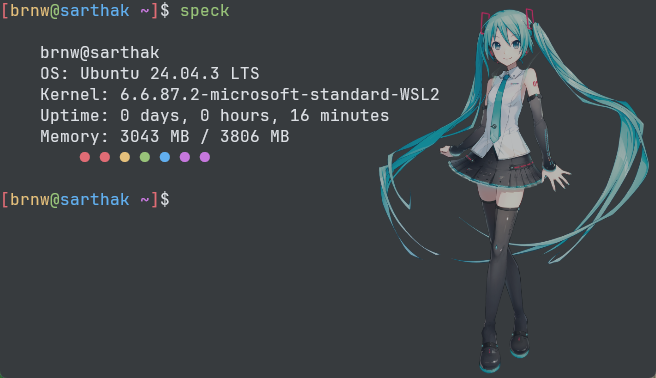

# speck

A tiny, colorful system fetch utility written in C ✨  
Think of it as a super lightweight `neofetch`, but way simpler — just the essentials with some rainbow dots 🌈  

---

## 📸 Screenshot

Here’s what `speck` looks like in action:



---

## ✨ Features
- Prints:
  - **Username & hostname**
  - **OS info** (from `/etc/os-release`)
  - **Kernel version**
  - **Uptime** (days, hours, minutes)
  - **Memory usage** (free / total)
- Adds a splash of color with rainbow dots 🎉
- Tiny, simple, beginner-friendly codebase

---

## 🚀 Build & Run

Clone the repo:
```bash
git clone https://github.com/sarthakbrnw/speck.git
cd speck
```

Compile:
```bash
gcc main.c -o speck
```

Run locally:
```bash
./speck
```

---

## 📦 Installation (as a command)

To use `speck` anywhere in your terminal:

```bash
# Build
gcc main.c -o speck

# Move to /usr/local/bin (requires sudo)
sudo mv speck /usr/local/bin/
```

Now you can run it from anywhere with:
```bash
speck
```

To uninstall, simply remove it:
```bash
sudo rm /usr/local/bin/speck
```

---

## ⚡ Notes
- Works on **Linux only** (relies on `/etc/os-release`, `/etc/hostname`, and `sysinfo`).
- Made as a **learning project in C**.
- No external dependencies (just standard C + POSIX).

[](https://x.com/sarthakbrnw)
[](https://medium.com/@sarthakbrnw)
[](https://discordapp.com/users/1389657764481077401)
[](mailto:sarthakbrnw@proton.me)